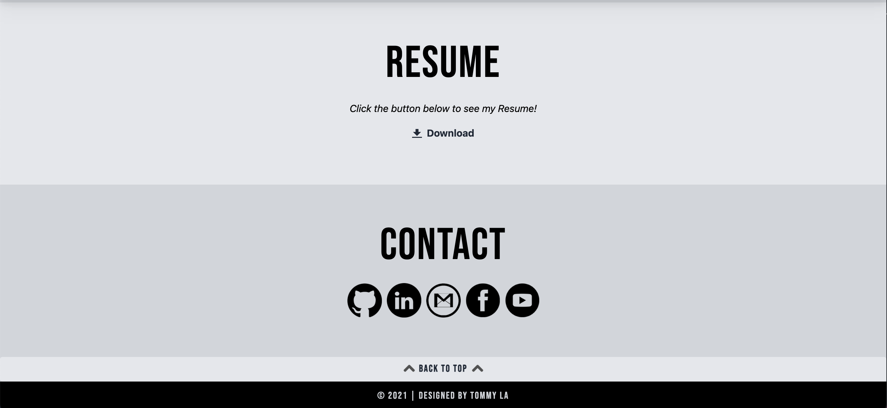

# Minimalist V2 Portfolio

This project was for my UCSD coding bootcamp. Revising my old portfolio and applying the new skills that I've learned in the past weeks.

## Demo & Repository

* [GitHub Repo](https://github.com/latommyla/Minimalist-V2)
* [GitHub Deployed Live URL](https://latommyla.github.io/Minimalist-V2/)

## Description

Updating my old portfolio that I created on the 2nd week of my bootcamp with all the new stuff I've learned in the past weeks. Added all the new homeworks and projects that I had to the portfolio.

## What was used in this project?

- HTML
- Tailwind CSS 
- JS

## Feature 

- One HTML Page - index.html
- Two CSS Pages - styles.css & /docs/styles.css
- Two JS Pages - postcss.config.js & tailwind.config.js

## Installation 

To install this project, simply download the zip file or clone the SSH key to your terminal. GitHub has instructions on how to do this. Also will need to install NODE in order to run build functions within your terminal.

## How it works?

- When viewing the deployed application, you will be presented with the users profile picture and name, along with a slogan.

- As you are scrolling down the page, you then will noticed that the Navigation bar is fixed. Also the About Me section will appear.

- Then the Work section appears with all the current homework that I did and the first project with my classmates.

- Resume and Contact section is last. Also a Back to Top button is at the bottom for easy access to the main page.

## Contact 

- [Portfolio](https://latommyla.github.io/TL-Portfolio/)
- [LinkedIn](https://www.linkedin.com/in/tommymla/)
- [My Gmail](mailto:tommyl.dmd@gmail.com)
- [GitHub](https://github.com/latommyla)
- [Instagram](https://instagram.com/latommyla)